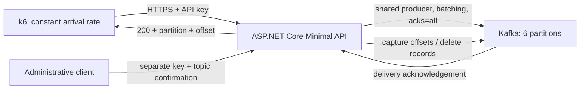

# Kafka Ingestion API

[](https://github.com/gersonlucasangeloviana/kafka-ingestion-api/actions/workflows/ci.yml)

A small, production-shaped **.NET 10 Minimal API** that publishes string IDs to Apache Kafka and measures **broker-acknowledged throughput** with k6.

Built as a reproducible engineering portfolio: explicit delivery semantics, feature-based organization, separate administrative credentials, bounded resource usage, real Kafka integration tests, and a gated performance experiment.



## Quick start

Requirements: Docker with Compose; .NET 10 SDK for local development; k6 and Python 3 for load testing.

```bash
cp .env.example .env.local
# Replace the two placeholder credentials with distinct secret values.
# A generated .env.local may already exist in the original workspace.
docker compose --env-file .env.local -f docker-compose.yml -f compose.local.yaml up -d --build --wait
```

The API listens on `http://localhost:8080` (override the host port with `API_PORT=8085` if needed). Kafka's local listener is `localhost:19092`. Both published ports bind only to loopback. The base `docker-compose.yml` publishes no host ports and is intended for Dokploy: the API joins the existing external `dokploy-network` for Traefik and the project's default network for Kafka. The local override uses a project-local network instead and disables Traefik discovery, so local development does not require Dokploy.

`.env.local` is ignored by Git and excluded from Docker build context. Docker Compose does not automatically load that filename: use `--env-file .env.local`. Native .NET also does not automatically load it; use `./scripts/run-api.sh`.

Load credentials into your shell without placing their values in command history:

```bash
set -a
source .env.local
set +a
curl --fail-with-body http://localhost:8080/api/v1/messages \
  -H 'Content-Type: application/json' \
  -H "X-Api-Key: $Authentication__ApiKey" \
  -d '{"id":"customer-123"}'
```

Example response:

```json
{"id":"customer-123","topic":"benchmark.ids","partition":2,"offset":42}
```

The Kafka record's key and value are the original ID string. Partition and offset are assigned by Kafka. IDs must be nonblank and at most 256 UTF-8 bytes; the API does not trim or rewrite them.

## Endpoints

| Method | Route | Access | Behavior |
|---|---|---|---|
| POST | `/api/v1/messages` | Publication or admin key | Publishes `{ "id": "..." }`; returns 200 after Kafka acknowledgement |
| DELETE | `/api/v1/admin/topic/records` | Admin key, purge enabled, topic confirmation | Deletes records before a snapshot of the end offset in every partition |
| GET | `/health/live` | Public | Process liveness |
| GET | `/health/ready` | Public | Configured topic has available partition leaders |
| GET | `/openapi/v1.json` | Publication or admin key | Native ASP.NET Core OpenAPI document |

Unauthenticated calls receive 401; publication credentials cannot purge (403). Invalid IDs receive 400; overload receives 429; unconfirmed Kafka operations receive 503 with Problem Details. Request bodies are capped at 4 KiB.

## Delivery guarantees and limitations

- One shared, thread-safe producer batches concurrent HTTP requests; no producer is created per request.
- `acks=all` and producer idempotence are enabled. HTTP 200 means Kafka acknowledged the record; it does not mean a downstream consumer processed it.
- Producer idempotence protects Kafka's internal retries within a producer session. Repeated HTTP calls with the same ID can still create multiple records. There is no HTTP deduplication store.
- A timeout or disconnected client can leave an ambiguous outcome: the record may already exist. Blind HTTP retries may duplicate it.
- A single broker with replication factor 1 is a VPS benchmark configuration. It provides no replica redundancy; `acks=all` is not an fsync-per-message guarantee. Production durability needs a multi-broker design and an appropriate minimum in-sync replica policy.
- Liveness is separate from readiness. Readiness verifies metadata/partition leaders, not a write on every probe. An actual publication remains the authoritative write check.
- Ingestion accepts up to 8,192 concurrent requests by default, without an artificial requests-per-second cap. Excess concurrency is rejected rather than queued without bounds.

## Clearing the benchmark topic

Kafka stores a partitioned log; consuming a record does not remove it. The administrative endpoint uses Confluent's `ListOffsetsAsync` and `DeleteRecordsAsync` against the **configured topic only**.

```bash
# Set Kafka__EnablePurge=true and redeploy before calling this endpoint.
curl --fail-with-body -X DELETE http://localhost:8080/api/v1/admin/topic/records \
  -H "X-Api-Key: $Authentication__AdminApiKey" \
  -H "X-Confirm-Topic: $Kafka__Topic"
```

Pause producers before clearing if the topic must be empty at completion. Numeric offsets are captured per partition; records appended after each snapshot remain. The operation is not atomic across partitions and can partially succeed on failure. Repeating it takes a new snapshot and can remove newer records. It preserves topic configuration and does **not** reset offsets to zero or reset consumer-group positions. Disk space is reclaimed by Kafka asynchronously. Administrative concurrency is limited per API instance, not across replicas.

Consumer groups resuming below the new low watermark need an appropriate `auto.offset.reset` setting. Creating a fresh topic per experiment is preferable when tests require fresh offsets. Existing topics retain their settings; defaults are applied only when this API creates a topic (6 partitions, replication factor 1, one-hour retention).

## Performance experiment

```bash
BASE_URL=https://your-api.example.com ./scripts/run-load-tests.sh
```

The runner warms up at 100 req/s, then measures **100, 200, 300, 400, 500, 600, 700, 800, 900, 1,000, 3,000 and 5,000 req/s**, each for 60 seconds. It advances only when all thresholds pass:

- HTTP error rate below 0.1% and acknowledgement success above 99.9%.
- p95 latency below 200 ms; p99 below 500 ms (configurable).
- Zero `dropped_iterations`; generator capacity is part of the validity check.

These are initial acceptance criteria, not promised capacity. Results and a Markdown comparison report are saved under ignored `artifacts/load-tests/`. Every measured iteration contains exactly one publication request. A readiness check happens outside the measurement scenario.

```bash
# Short local smoke run; not a capacity claim.
RATES='100 200' DURATION=10s WARMUP=false COOLDOWN_SECONDS=0 ./scripts/run-load-tests.sh

# Customize latency criteria and virtual-user allocation for the real experiment.
P95_MS=200 P99_MS=500 PRE_ALLOCATED_VUS=1500 MAX_VUS=7500 \
  BASE_URL=https://your-api.example.com ./scripts/run-load-tests.sh
```

Run k6 on a separate machine, record VPS CPU/RAM/disk, broker/API limits, image versions, network path, partition count and competing workloads, and repeat each measurement at least three times. Watch API CPU/memory/GC, broker CPU/disk/network and generator CPU. Do not clear the topic during a measurement or immediately before the next stage. See [performance methodology](docs/performance.md).

[A short local validation](docs/local-smoke-test.md) passed all stages up to 5,000 req/s, with 50,001 acknowledged publications in the last 10-second stage and zero errors or dropped iterations. This is a functional smoke result, not a sustained-capacity claim.

**No VPS capacity result has been claimed.** The repository provides the experiment; actual maximum throughput must be measured on the target deployment.

## Development and verification

```bash
dotnet restore --locked-mode
dotnet build -c Release --no-restore
dotnet format --verify-no-changes --no-restore
dotnet test -c Release --no-build

# Real broker integration (start the local Kafka service first).
KAFKA_INTEGRATION_BOOTSTRAP_SERVERS=localhost:19092 \
  dotnet test -c Release --filter Category=KafkaIntegration
```

Tests cover authentication, publication contract, UTF-8 validation, unavailable Kafka, readiness, administrative access and real publication/consumption/deletion. CI additionally builds the Docker image. Locked NuGet dependencies and compiler/analyzer warnings as errors keep changes reproducible.

The integration test creates a unique temporary topic and deletes it afterward. Never point it at a production cluster without permission to create/delete temporary topics.

## Project organization

```text
src/KafkaIngestion.Api/
  Features/Messages/          HTTP publication contract
  Features/Administration/    Guarded record deletion
  Messaging/                 Kafka implementation and application-facing interface
  Security/                  API key authentication
  Configuration/             Validated startup settings
  Diagnostics/               Health checks and Problem Details
tests/KafkaIngestion.Api.Tests/
load-tests/
scripts/
docs/
```

The composition root stays in `Program.cs`. The gateway interface isolates the external broker for contract tests; it is not a generic repository abstraction. No database, mediator, or separate domain project is needed for this small service. See [architecture decisions](docs/architecture.md) and the [Dokploy guide in Portuguese](docs/dokploy.pt-BR.md).

## References

Project journal in Portuguese: [infrastructure, configuration history and evidence for LinkedIn/YouTube](docs/diario-do-projeto.pt-BR.md).

- [Microsoft: .NET support policy](https://dotnet.microsoft.com/en-us/platform/support/policy)
- [Microsoft: Minimal APIs](https://learn.microsoft.com/aspnet/core/fundamentals/minimal-apis?view=aspnetcore-10.0)
- [Confluent: .NET producer](https://docs.confluent.io/kafka-clients/dotnet/current/overview.html)
- [Confluent: Admin API and record deletion](https://docs.confluent.io/platform/current/clients/confluent-kafka-dotnet/_site/api/Confluent.Kafka.IAdminClient.html)
- [Grafana: constant arrival rate](https://grafana.com/docs/k6/latest/using-k6/scenarios/executors/constant-arrival-rate/)
- [Dokploy: Compose](https://docs.dokploy.com/docs/core/docker-compose)

Licensed under MIT.
